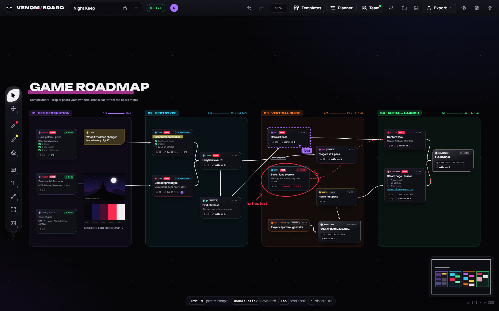
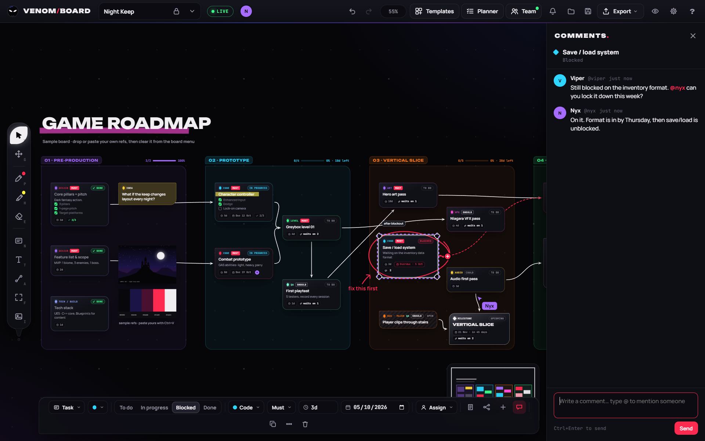
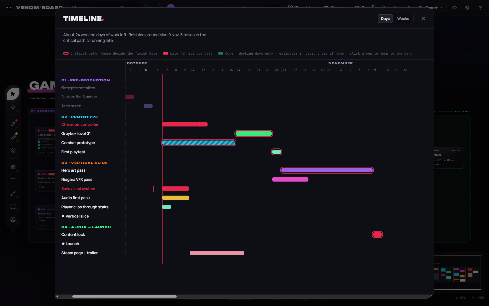
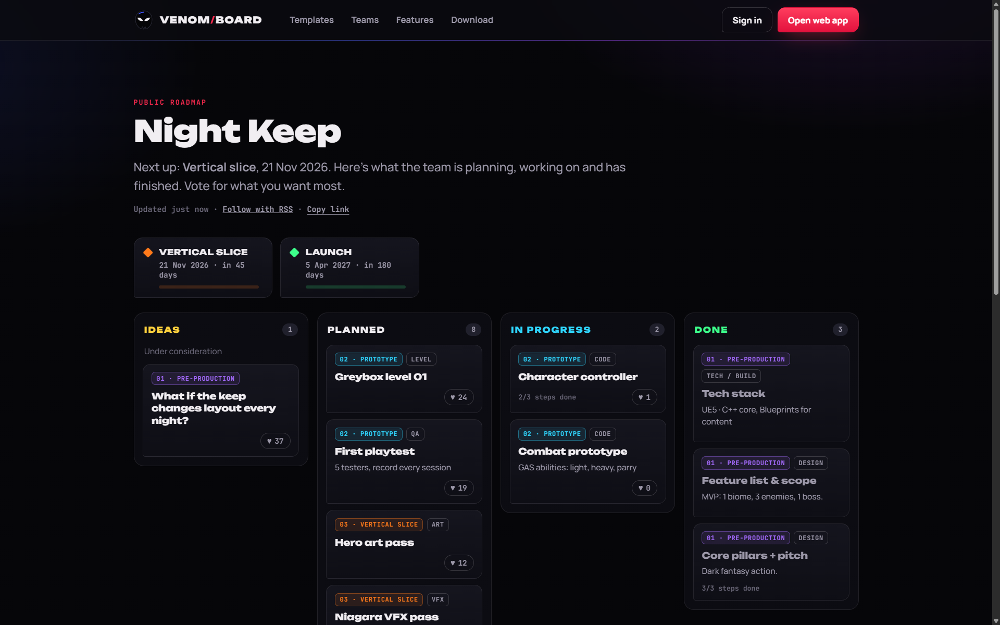
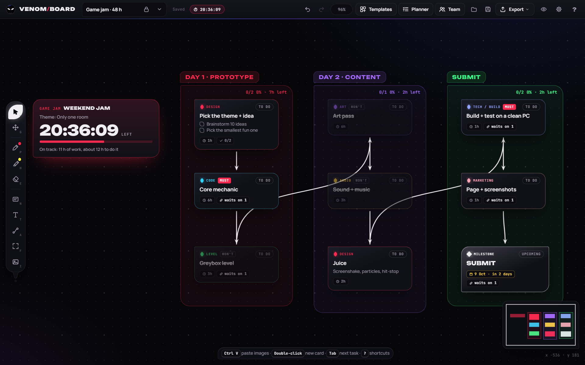

<p align="center">
  
</p>

<p align="center">
  <a href="https://github.com/1337VIPER/venom-board/releases/latest"></a>
  
  <a href="https://venomboard.com/app"></a>
  <a href="https://1337viper.itch.io/venom-board"></a>
  <a href="LICENSE"></a>
</p>

<p align="center">
  <b>Pin your references, map your whole production as a living network of tasks, milestones and bugs, and build it with your team live, all on one infinite canvas that can float on top of your engine.</b>
</p>

---



## Why Venom Board?

Game production lives in three places at once: a folder of reference images, a task list, and the plan in your head of *what unlocks what*. Venom Board puts all three on a single canvas.

- **It's a reference board** like PureRef, and it opens your PureRef boards: paste screenshots, drop in concept art, scribble over it with markers.
- **It's a roadmap** with real planning data: phases, milestones, estimates, priorities, due dates and bugs.
- **It's a dependency network**: drag a tendril from one card to the next and the board works out what's blocked and what's ready to start.
- **It's a schedule**: the timeline turns your estimates and links into a critical path and a finish date, and the Planner tracks a burndown to your next milestone.
- **It's multiplayer**: make a free account at [venomboard.com](https://venomboard.com), invite your team and edit shared projects together live, with comments, @mentions and assignments.
- **It connects to your tools**: anything that supports the Model Context Protocol (MCP) can work on a team board the way you do, from mapping out a project to laying out references.
- **It's a public roadmap**: publish a page your players can follow and vote on, straight from the board.
- **It's jam-ready**: a countdown, the theme, and a scope check that tells you what to cut before the deadline does.
- **It's an overlay**: pin it on top of Unreal, Unity or Godot, turn the opacity down, and let clicks pass straight through to your engine.

Solo boards need no account, no subscription and no telemetry. They work offline, and they're plain `.json` files you can back up or commit to your game's repo.

## Download

| | |
|---|---|
| **Windows** | Download `VenomBoard-Setup-1.4.2.exe` from the [latest release](https://github.com/1337VIPER/venom-board/releases/latest) and run it. It installs for your Windows account in a few seconds (no admin rights needed) and adds Start menu and desktop shortcuts. **It keeps itself up to date**: new versions download in the background and install when you restart. |
| **macOS** | Download `VenomBoard-1.4.2-mac.zip` (Apple silicon and Intel), open it (Safari unzips it for you) and drag Venom Board into Applications. When a new version is out, *Get 1.x.x* appears in the top bar. |
| **Linux** | Download `VenomBoard-1.4.2.AppImage`, make it executable (`chmod +x VenomBoard-1.4.2.AppImage`, or Properties → Allow executing) and run it. It keeps itself up to date like the Windows app. |
| **Browser** | Use the web app at [venomboard.com/app](https://venomboard.com/app), try it on [itch.io](https://1337viper.itch.io/venom-board), or download `VenomBoard-1.4.2-web.zip`, unzip it and open `index.html` in Chrome, Edge or Firefox. Pin on top, click-through and window opacity need a desktop app. |

> **Windows SmartScreen:** the installer isn't code-signed yet, so Windows may show *"Windows protected your PC"* the first time. Click **More info → Run anyway**. Updates after that install without the warning.
>
> **macOS:** the app isn't notarized by Apple yet, so the first time you open it macOS says it can't check it. Click **Done**, then open **System Settings → Privacy & Security**, scroll down and click **Open Anyway** next to Venom Board. On macOS 14 and older you can instead Control-click the app and choose **Open**. After that it opens normally.
>
> **Coming from 1.0.0?** The 1.0.0 zip version can't update itself. Install the new version once and you'll get every update after that automatically. Your boards carry over.

## Features

### Reference board
- Infinite canvas: the mouse wheel zooms at the cursor, Space or middle-drag pans, and there's a minimap for big boards
- Paste screenshots with `Ctrl+V`, drag images in from Explorer or a browser, flip, greyscale or reset to original size
- **Marker** (8 colours + custom), **highlighter** and **eraser**. Ink drawn on a card or image moves with it
- Snap guides, align, distribute, pack into a grid, lock items, bring to front or send to back
- **Videos and GIFs** as references: GIFs animate on the board, video files play on hover or double-click (loop, autoplay, sound), and YouTube or Vimeo links become players that only load when you click them
- **Import PureRef boards**: drop a `.pur` file (PureRef 1.x or 2.x) on the board or use Import. Pictures keep their places, sizes, rotation, flips and crops, notes become text and groups become frames, placed next to what's already there
- **Replace** a picture or video with another file or link (right-click → Replace, or ⇄ in its toolbar). It keeps its place, width, connectors and settings, takes the new shape, and a picture can become a YouTube, Vimeo or video file and back
- Export the whole board or just the selection as a 2× PNG
- **Timelapse**: turn a board's history into a video of it coming together (landscape, square or vertical, saved as MP4 or WebM), ready for #screenshotsaturday, TikTok or Shorts. Team projects use their version history; boards on your computer keep a snapshot every 20 minutes of work

### Production planning
- Four card types: **Task**, **Milestone**, **Bug** (crash / major / minor / polish) and **Idea note**
- Status, **discipline** (Code, Art, Design, Level, Audio, UI/UX, VFX, Narrative, QA, Tech/build, Marketing), **MoSCoW priority** for scope cuts, **estimates** (`4h`, `2d`, `1w`) and **due dates** that turn red when overdue
- Checklists inside notes: any line starting with `[ ]` becomes a clickable checkbox, with progress on the card
- **Tendril connectors**: curved, straight, elbow or **circuit** (straight runs with 45° bends, like Electric Nodes in Unreal), with arrowheads, dashes, labels and an animated flow. Right-click a wire to add **reroute points** and drag them to route your noodles tidily (they snap into line with their neighbours); double-click one to remove it. Right-click the board → *Style every connector* switches every wire at once
- **Place next**: drag a connector out of a card into empty space and choose what comes next, Blueprint-style. `Tab` adds the next connected task instantly
- **Dependency awareness**: cards show *waits on N* while anything feeding into them is unfinished, the *Ready to start* filter lists what you can pick up today, and **Trace** highlights a card's whole chain of dependencies
- **Phase frames** carry everything inside them when moved and show finished tasks, progress and remaining estimate in their header
- **Planner panel** (`Ctrl+F`): percent done, ready count, days of work left, open bugs, overdue items, milestone countdowns, a **burndown chart** to the next milestone, search and filters (including *Mine*) that dim the rest of the board
- **Timeline** (`Shift+G`): every task scheduled in working days from its estimate and what it waits on, with the **critical path** that decides your finish date, due dates you'll miss, and finished work
- **Import** from **Trello** (JSON export), **Jira** (CSV export) or any spreadsheet saved as CSV: lists, sprints or statuses become phases, with statuses, priorities, estimates, due dates and checklists carried over
- **Search everything** (`Ctrl+Shift+F`): every board on this computer and every team project you're in, at once
- **12 game-dev templates**: game roadmap, feature, level and character pipelines, vertical slice, weekly sprint board, bug triage, playtest loop, 48-hour game jam, Steam launch, a design-doc outline and an art moodboard. Browse them at [venomboard.com/templates](https://venomboard.com/templates) and open one in a click
- **Game jam clock**: the deadline counting down on the board and in the top bar, the theme (or when it's revealed), a scope check of the work left against the time you have, and **Cut scope** to drop the lowest-priority work until it fits, with reminders as the deadline nears
- **Export to Markdown** (GitHub, Notion, Discord) and **CSV** (Sheets, Jira, Trello)
- **Board lock**: a view-only mode for reviews and sharing, so nothing gets nudged by accident

### Teams and live collaboration
- **Free accounts** at [venomboard.com](https://venomboard.com). Sign in from the **Team** panel in the desktop app or the web app
- **Teams** with a leader, team admins, editors and viewers. Invite people by username or email; they accept from the app or the website
- **Shared projects**: each team has a project list. **Share this board** turns any board into a team project
- **Live editing**: every card, connector, frame, image, ink stroke and text appears for everyone as it happens, including drags, resizes and typing in progress
- **Always up to date**: the Team panel shows new, renamed and deleted projects, answered invites and people joining, leaving or changing role the moment it happens, and notifications arrive straight away, even between projects. An invite that arrives while you work says so
- **Presence**: teammates' avatars in the top bar, their cursors and selections on the canvas, and *is typing…* labels
- **Assign cards** to teammates: their avatars on the card, *Mine* in the Planner, and a notification for whoever you assign
- **Comments and @mentions** on every card, live, with suggestions as you type. Viewers can comment too, so reviewers and playtesters can leave feedback
- **Notifications**: the bell shows mentions and assignments and opens the card for you; mentions and a morning list of your tasks due soon can come by email (each can be turned off)
- **Activity feed**: who added, finished, deleted or commented on what, gathered into readable lines
- **Follow** a teammate's view by clicking their avatar, or **present** (editors and up) so everyone in the project follows you
- **Version history**: the board is kept before each burst of editing, plus versions you name; restore any of them for everyone, or open one as a copy
- **View-only links**: anyone with the link can watch a board live without an account, without seeing who's there or changing anything. Posted on Discord, Reddit or X, a link shows a picture of the board
- **Public roadmaps**: a page your players can follow, with your phases, what's planned, in progress and done, milestone dates, votes on what they want most, an RSS feed and an embed for your own site. Pictures, comments, people and estimates are never shown, and any card can be kept off it
- **Discord**: post finished tasks, reached milestones, comments, restores and new members to a channel
- **Connect tools (MCP)**: assistants and planning tools that support the Model Context Protocol can work on your team boards the way you do. They plan (projects from templates, phases, cards with estimates, priorities, disciplines and assignees, dependencies, the schedule and critical path, comments) and lay out the board (text, frames, pictures and GIFs from the web or your computer, YouTube and Vimeo videos, replacing pictures and videos, marker and highlighter ink, connectors, a game jam clock, moving, aligning, duplicating and stacking), and they can save and restore versions. They act as you, with your role in each team, and what they change shows up live for everyone and stays in version history. Make an access token at [venomboard.com/account](https://venomboard.com/account#mcp) (Settings → Account → Connect tools has a link); changing your password or signing out everywhere revokes every token
- **Viewers** watch live without being able to change anything
- **Account settings** (`Ctrl+,`): change your display name, your cursor colour and your password, turn on **two-step sign-in** with an authenticator app (with recovery codes), see where you're signed in and sign out everywhere else, or delete your account

### Overlay mode (desktop app)
- **Pin on top** and an **opacity slider** in the top bar
- **Click-through**: clicks pass straight through the board to the app underneath. Turn it off from anywhere with a global shortcut (default `Ctrl+Shift+X`, customisable) or the tray icon
- **Lock window in place**, **hide the top bar**, or hide the whole interface with `\`
- **Automatic updates**: the app checks for new versions when it starts, downloads them in the background and installs them when you restart. *Restart to update* appears in the top bar when one is ready, and **Check for updates** is in the Window menu. Every update is checked against Venom Board's update signature before it installs
- Right-click anywhere for the Window menu. Every window option is also in **Settings** (`Ctrl+,`)
- Two skins: **Venom** (dark) and **Anti-Venom** (light)
- **Fits any screen**: on small or low-resolution screens the top bar folds its least-used buttons into a **⋯** menu and the tool spine compacts, and **View → Interface size** (80–150%) scales everything up or down

## Screenshots

| | |
|---|---|
|  |  |
| **Comments and @mentions** · talk right on the card; teammates' cursors and selections show live | **Planner** · progress, a burndown to the next milestone, and filters that dim the rest of the board |
|  |  |
| **Timeline** · every task scheduled from its estimate and what it waits on, with the critical path | **Public roadmap** · a page players follow and vote on, made from your board |
|  |  |
| **Game jam clock** · the countdown, the theme, a scope check and Cut scope | **Templates** · twelve ready-made game production structures |
|  |  |
| **Cards** · discipline, priority, estimates, due dates, checklists and dependencies | **Place next** · drag a tendril into empty space to choose the next card |
|  |  |
| **Boards on your computer** · the sample roadmap, no account needed | **Overlay controls** · pin, lock, click-through, opacity, board lock |
|  | |
| **Anti-Venom** · the light skin | |

## Keyboard shortcuts

| Tools | | Planning | |
|---|---|---|---|
| `V` | Select and move | `Tab` | Add a connected task |
| `G` / hold `Space` | Pan | `Enter` | Edit the selected card |
| `P` / `H` / `E` | Marker, highlighter, eraser | `Ctrl+F` | Planner search and filters |
| `N` | Card | `PgDn` / `PgUp` | Fly between phases |
| `T` | Text | `Shift+1` / `Shift+2` | Fit board / fit selection |
| `A` | Connector | `Ctrl+Shift+K` | Lock the board |
| `F` | Phase frame | `Ctrl+Shift+L` | Lock selected items |
| `I` | Insert image or video | `Ctrl+,` | Settings |
| `Shift+G` | Timeline | `Ctrl+Shift+F` | Search every board and project |

| Editing | | Window (desktop) | |
|---|---|---|---|
| `Ctrl+Z` / `Ctrl+Shift+Z` | Undo / redo | `Ctrl+Shift+A` | Pin on top |
| `Ctrl+C` `X` `V` `D` | Copy, cut, paste, duplicate | `Ctrl+Shift+X` | Click-through on / off |
| `Alt`+drag | Duplicate while dragging | `Ctrl+Shift+B` | Hide the top bar |
| `Ctrl`+drag | Move without snapping | `\` | Hide the whole interface |
| `1`–`8`, `[` `]` | Ink colour, brush size | `Ctrl+S` / `Ctrl+O` / `Ctrl+E` | Save, open, export PNG |

Press `?` inside the app for the full list.

## Your data

- Boards autosave locally, and you can keep as many boards as you like.
- **Save** writes a `.venomboard.json` file containing the board and its images. Use it for backups, to move boards between computers, or to commit next to your project.
- The desktop app and a browser keep separate local storage; use Save and Open to move boards between them.
- Solo boards never leave your machine, videos included. Team projects, with their comments and versions, are stored on venomboard.com so everyone in the team can open them.

## Build from source

Requires [Node.js](https://nodejs.org) 22 or newer.

```bash
git clone https://github.com/1337VIPER/venom-board.git
cd venom-board
npm install
npm start
```

The first `npm start` downloads the Electron runtime. To build the Windows installer in `dist/`:

```bash
npm run dist
```

The Linux AppImage and the macOS app are built on those systems with `npx electron-builder --linux AppImage` and `npx electron-builder --mac zip --universal`. Release builds run in GitHub Actions, and `node tools/check-build.js <run id>` checks them against a build of the same commit on your own computer before the AppImage is signed with `node tools/sign-update.js`.

### Project layout

```
index.html        the entire app: UI, canvas engine, planner, timeline, templates, team client and export
electron/         desktop shell: window, pin, opacity, click-through, file dialogs and signed updates
  dev/            self-test and screenshot generator used during development
tools/            release checks: check-build.js and sign-update.js
.github/          the workflow that builds the Linux and macOS apps
assets/           app icon
docs/             banner, screenshots and template pictures
```

Because the whole app is one HTML file, the browser version and the desktop app always behave the same.

## Contributing

Bug reports and feature ideas are very welcome. Open an [issue](https://github.com/1337VIPER/venom-board/issues) and tell us how you plan your games. Pull requests are welcome too. Please keep changes focused and describe what you tested.

## Credits

**Venom Board is created by [1337VIPER](https://github.com/1337VIPER).**

The concept, the feature set, the workflow and the Venom visual direction all come from 1337VIPER's own ideas: a single board where game developers can collect references, plan production and keep it floating over their engine while they work.

## License

[MIT](LICENSE) © 2026 1337VIPER. Free to use, modify and share.
