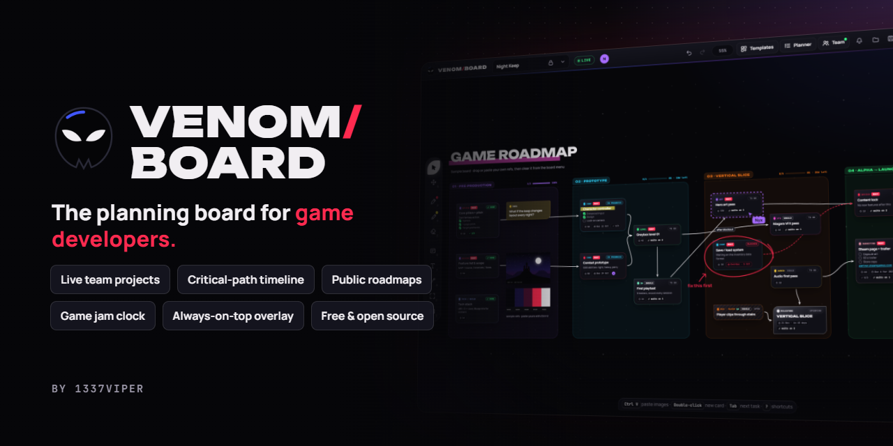
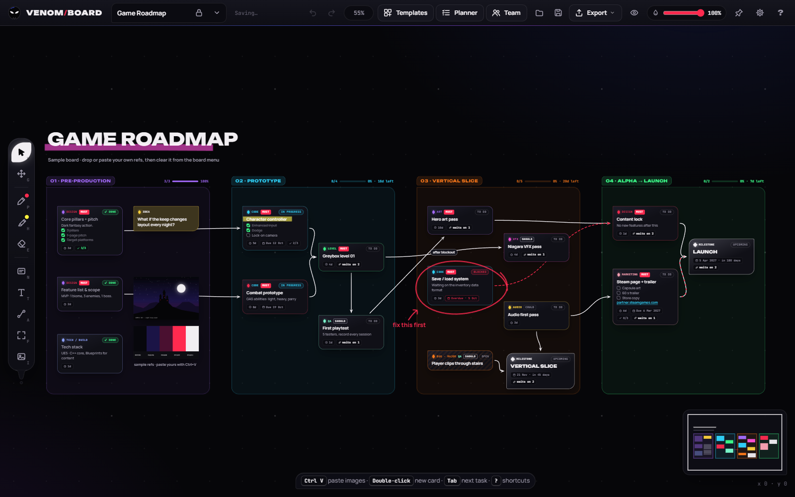
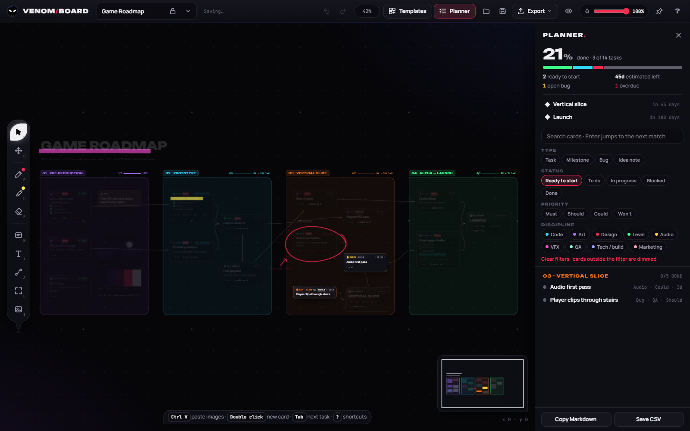
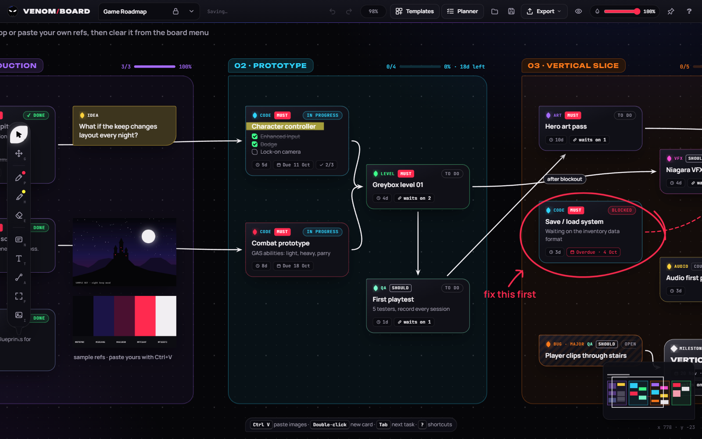
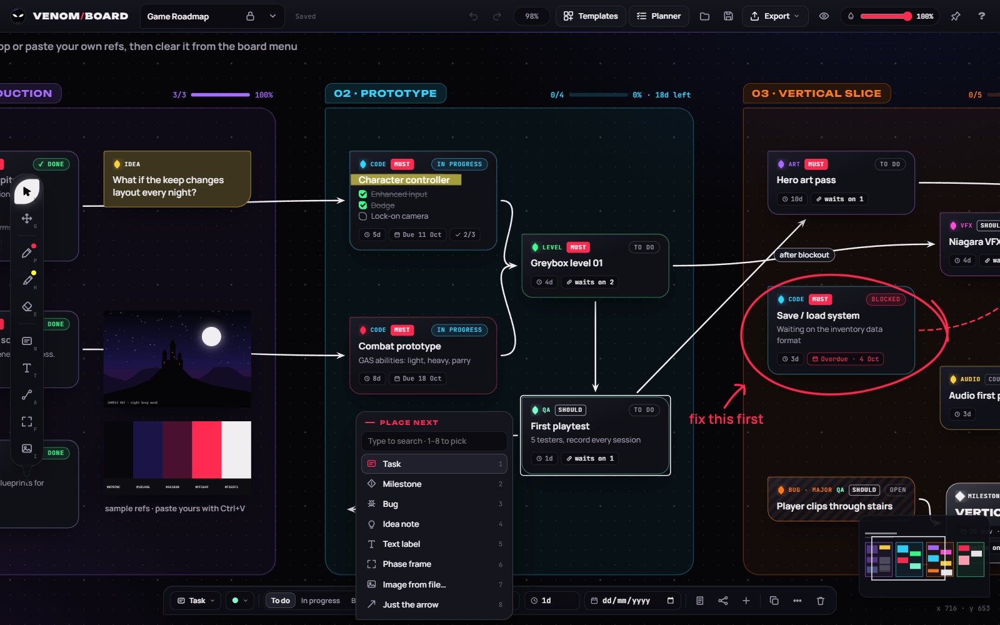
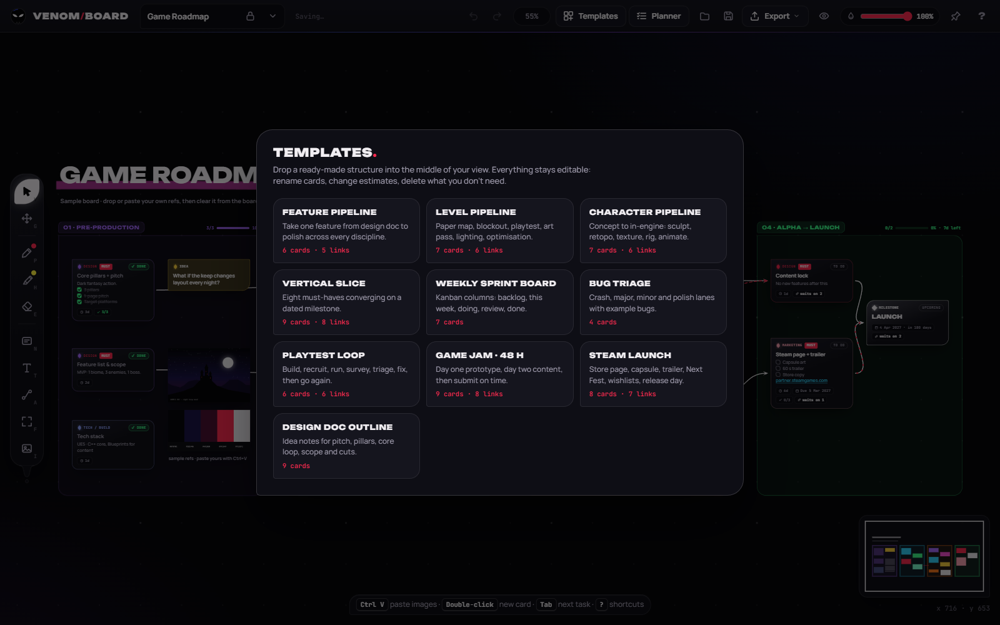
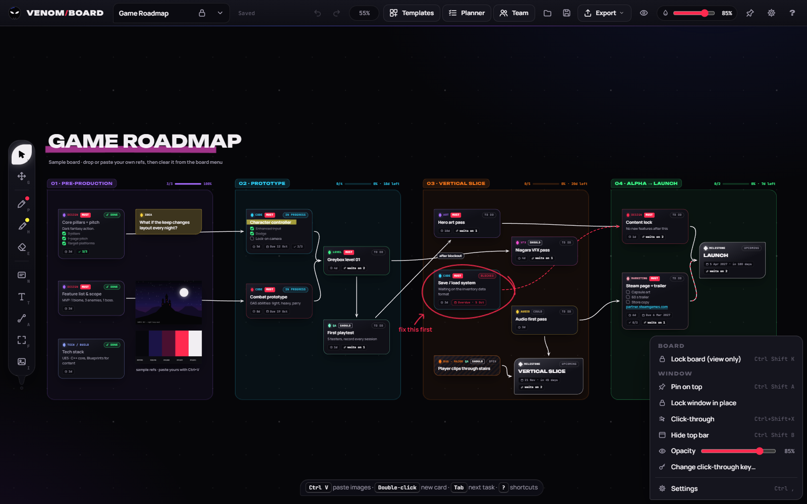
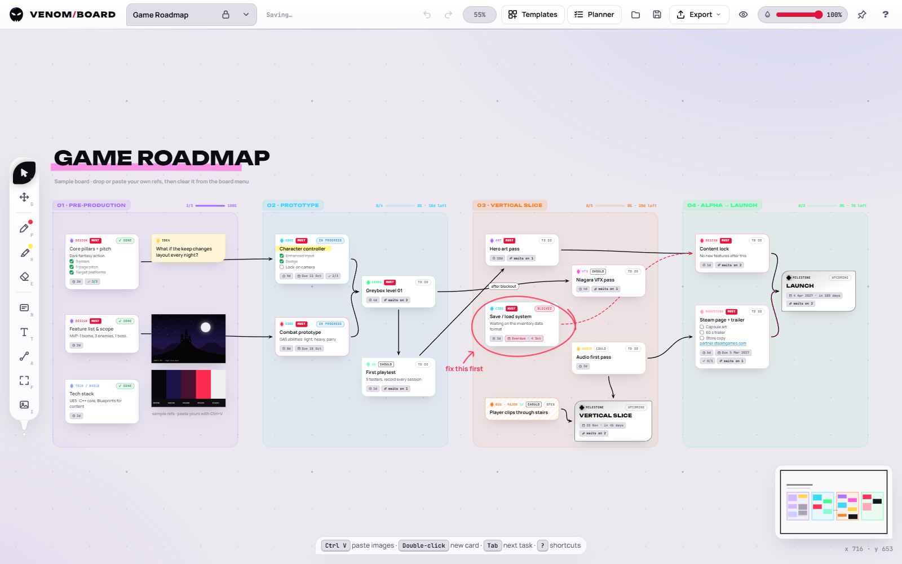

<p align="center">
  
</p>

<p align="center">
  <a href="https://github.com/1337VIPER/venom-board/releases/latest"></a>
  
  
  <a href="LICENSE"></a>
</p>

<p align="center">
  <b>Pin your references, mark them up, and map your whole production as a living network of tasks, milestones and bugs, all on one infinite canvas that can float on top of your engine.</b>
</p>

---



## Why Venom Board?

Game production lives in three places at once: a folder of reference images, a task list, and the plan in your head of *what unlocks what*. Venom Board puts all three on a single canvas.

- **It's a reference board** like PureRef: paste screenshots, drop in concept art, scribble over it with markers.
- **It's a roadmap** with real planning data: phases, milestones, estimates, priorities, due dates and bugs.
- **It's a dependency network**: drag a tendril from one card to the next and the board works out what's blocked and what's ready to start.
- **It's an overlay**: pin it on top of Unreal, Unity or Godot, turn the opacity down, and let clicks pass straight through to your engine.

- **It's multiplayer**: make a free account at [venomboard.com](https://venomboard.com), invite your team and edit shared projects together live.

Solo boards need no account, no subscription and no telemetry. They work offline, and they're plain `.json` files you can back up or commit to your game's repo.

## Download

| | |
|---|---|
| **Windows desktop app** | Download `VenomBoard-Setup-1.1.2.exe` from the [latest release](https://github.com/1337VIPER/venom-board/releases/latest) and run it. It installs for your Windows account in a few seconds (no admin rights needed) and adds Start menu and desktop shortcuts. **It keeps itself up to date**: new versions download in the background and install when you restart. |
| **Browser version** | Download `VenomBoard-1.1.2-web.zip`, unzip it and open `index.html` in Chrome, Edge or Firefox, or use the web app at [venomboard.com/app](https://venomboard.com/app). Pin on top, click-through and window opacity need the desktop app. |

> **Windows SmartScreen:** the installer isn't code-signed yet, so Windows may show *"Windows protected your PC"* the first time. Click **More info → Run anyway**. Updates after that install without the warning.
>
> **Coming from 1.0.0?** The 1.0.0 zip version can't update itself. Install the new version once and you'll get every update after that automatically. Your boards carry over.

## Features

### Reference board
- Infinite canvas: the mouse wheel zooms at the cursor, Space or middle-drag pans, and there's a minimap for big boards
- Paste screenshots with `Ctrl+V`, drag images in from Explorer or a browser, flip, greyscale or reset to original size
- **Marker** (8 colours + custom), **highlighter** and **eraser**. Ink drawn on a card or image moves with it
- Snap guides, align, distribute, pack into a grid, lock items, bring to front or send to back
- Export the whole board or just the selection as a 2× PNG

### Production planning
- Four card types: **Task**, **Milestone**, **Bug** (crash / major / minor / polish) and **Idea note**
- Status, **discipline** (Code, Art, Design, Level, Audio, UI/UX, VFX, Narrative, QA, Tech/build, Marketing), **MoSCoW priority** for scope cuts, **estimates** (`4h`, `2d`, `1w`) and **due dates** that turn red when overdue
- Checklists inside notes: any line starting with `[ ]` becomes a clickable checkbox, with progress on the card
- **Tendril connectors**: curved, straight or elbow, with arrowheads, dashes, labels and an animated flow
- **Place next**: drag a connector out of a card into empty space and choose what comes next, Blueprint-style. `Tab` adds the next connected task instantly
- **Dependency awareness**: cards show *waits on N* while anything feeding into them is unfinished, the *Ready to start* filter lists what you can pick up today, and **Trace** highlights a card's whole chain of dependencies
- **Phase frames** carry everything inside them when moved and show finished tasks, progress and remaining estimate in their header
- **Planner panel** (`Ctrl+F`): percent done, ready count, days of work left, open bugs, overdue items, milestone countdowns, search and filters that dim the rest of the board
- **10 game-dev templates**: feature, level and character pipelines, vertical slice, weekly sprint board, bug triage, playtest loop, 48-hour game jam, Steam launch and a design-doc outline
- **Export to Markdown** (GitHub, Notion, Discord) and **CSV** (Sheets, Jira, Trello)
- **Board lock**: a view-only mode for reviews and sharing, so nothing gets nudged by accident

### Teams and live collaboration
- **Free accounts** at [venomboard.com](https://venomboard.com). Sign in from the **Team** panel in the desktop app or the web app
- **Teams** with a leader, team admins, editors and viewers. Invite people by username or email; they accept from the app or the website
- **Shared projects**: each team has a project list. **Share this board** turns any board into a team project
- **Live editing**: every card, connector, frame, image, ink stroke and text appears for everyone as it happens, including drags, resizes and typing in progress
- **Presence**: teammates' avatars in the top bar, their cursors and selections on the canvas, and *is typing…* labels
- **Viewers** watch live without being able to change anything
- **Account settings** (`Ctrl+,`): change your display name, your cursor colour and your password, see where you're signed in and sign out everywhere else, or delete your account

### Overlay mode (desktop app)
- **Pin on top** and an **opacity slider** in the top bar
- **Click-through**: clicks pass straight through the board to the app underneath. Turn it off from anywhere with a global shortcut (default `Ctrl+Shift+X`, customisable) or the tray icon
- **Lock window in place**, **hide the top bar**, or hide the whole interface with `\`
- **Automatic updates**: the app checks for new versions when it starts, downloads them in the background and installs them when you restart. *Restart to update* appears in the top bar when one is ready, and **Check for updates** is in the Window menu. Every update is checked against Venom Board's update signature before it installs
- Right-click anywhere for the Window menu. Every window option is also in **Settings** (`Ctrl+,`)
- Two skins: **Venom** (dark) and **Anti-Venom** (light)
- **Fits any screen**: on small or low-resolution screens the top bar folds its least-used buttons into a **⋯** menu and the tool spine compacts, and **View → Interface size** (80–150%) scales everything up or down

## Screenshots

| | |
|---|---|
|  |  |
| **Planner** · progress, milestone countdowns and filters that dim the rest of the board | **Cards** · discipline, priority, estimates, due dates, checklists and dependencies |
|  |  |
| **Place next** · drag a tendril into empty space to choose the next card | **Templates** · ten ready-made game production structures |
|  |  |
| **Overlay controls** · pin, lock, click-through, opacity, board lock | **Anti-Venom** · the light skin |

## Keyboard shortcuts

| Tools | | Planning | |
|---|---|---|---|
| `V` | Select and move | `Tab` | Add a connected task |
| `G` / hold `Space` | Pan | `Enter` | Edit the selected card |
| `P` / `H` / `E` | Marker, highlighter, eraser | `Ctrl+F` | Planner search and filters |
| `N` | Card | `PgDn` / `PgUp` | Fly between phases |
| `T` | Text | `Shift+1` / `Shift+2` | Fit board / fit selection |
| `A` | Connector | `Ctrl+Shift+K` | Lock the board |
| `F` | Phase frame | `Ctrl+Shift+L` | Lock selected items |
| `I` | Insert image | `Ctrl+,` | Settings |

| Editing | | Window (desktop) | |
|---|---|---|---|
| `Ctrl+Z` / `Ctrl+Shift+Z` | Undo / redo | `Ctrl+Shift+A` | Pin on top |
| `Ctrl+C` `X` `V` `D` | Copy, cut, paste, duplicate | `Ctrl+Shift+X` | Click-through on / off |
| `Alt`+drag | Duplicate while dragging | `Ctrl+Shift+B` | Hide the top bar |
| `Ctrl`+drag | Move without snapping | `\` | Hide the whole interface |
| `1`–`8`, `[` `]` | Ink colour, brush size | `Ctrl+S` / `Ctrl+O` / `Ctrl+E` | Save, open, export PNG |

Press `?` inside the app for the full list.

## Your data

- Boards autosave locally, and you can keep as many boards as you like.
- **Save** writes a `.venomboard.json` file containing the board and its images. Use it for backups, to move boards between computers, or to commit next to your project.
- The desktop app and a browser keep separate local storage; use Save and Open to move boards between them.
- Solo boards never leave your machine. Team projects are stored on venomboard.com so everyone in the team can open them.

## Build from source

Requires [Node.js](https://nodejs.org) 22 or newer.

```bash
git clone https://github.com/1337VIPER/venom-board.git
cd venom-board
npm install
npm start
```

The first `npm start` downloads the Electron runtime. To build the Windows installer in `dist/`:

```bash
npm run dist
```

### Project layout

```
index.html        the entire app: UI, canvas engine, planner, templates and export
electron/         desktop shell: window, pin, opacity, click-through, file dialogs
  dev/            self-test and screenshot generator used during development
assets/           app icon
docs/             banner and screenshots
```

Because the whole app is one HTML file, the browser version and the desktop app always behave the same.

## Contributing

Bug reports and feature ideas are very welcome. Open an [issue](https://github.com/1337VIPER/venom-board/issues) and tell us how you plan your games. Pull requests are welcome too. Please keep changes focused and describe what you tested.

## Credits

**Venom Board is created by [1337VIPER](https://github.com/1337VIPER).**

The concept, the feature set, the workflow and the Venom visual direction all come from 1337VIPER's own ideas: a single board where game developers can collect references, plan production and keep it floating over their engine while they work.

## License

[MIT](LICENSE) © 2026 1337VIPER. Free to use, modify and share.
