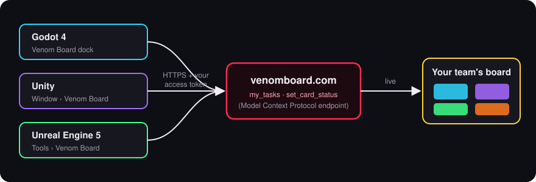
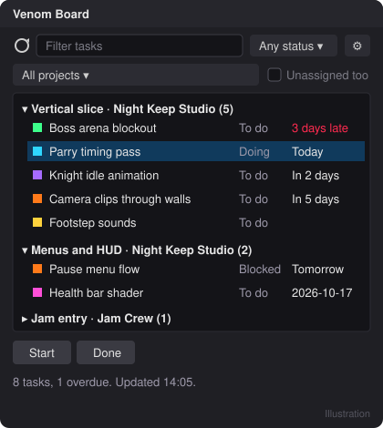
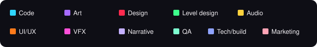

# Venom Board in your game engine

See your Venom Board tasks without leaving the editor. These panels for **Godot 4**, **Unity** and **Unreal Engine 5**
list the unfinished cards assigned to you across all your team projects, soonest due first, and let you start or
finish a card with one click. Everyone with the board open sees the change straight away.

<p align="center"></p>

- **My tasks**: every unfinished card assigned to you, from every team project you're in, grouped by project. Each
  task shows its status, when it's due ("Today", "Tomorrow", "In 3 days", "2 days late") and a colour swatch for its
  discipline. Overdue dates are red. Hover a task for its kind, priority, estimate, phase and who else is on it.
- **Filter** by any words (title, project, phase, discipline, priority) and by status: to do, doing, blocked or overdue.
- **One project at a time**: pick a project, and tick **Unassigned too** to see the cards nobody has taken yet.
- **Start** sets the selected card to Doing; **Done** finishes it and takes it off your list. Right-click for
  *Open in browser*, *Copy link*, *Mark blocked* and *Back to To do*.
- **Double-click** a task to open it on its board in your browser.
- Projects where you're a viewer are listed too, with the status buttons switched off.

<p align="center"></p>

The panels work with team projects on venomboard.com. Boards that only live on your computer aren't shared, so they
don't show up.

## Make an access token

The panels sign in with a personal access token, the same kind other tools that support the Model Context
Protocol use.

1. Sign in at [venomboard.com](https://venomboard.com/account#mcp) and open **Connect tools (MCP)** on your
   account page. (The panels' **Make a token** link takes you straight there.)
2. Name the token (for example "Unity on my desktop"), enter your password and choose **Create a token**.
3. Copy the token straight away: it starts with `vbt_` and isn't shown again.
4. Paste it into the panel's settings and choose **Save and connect**.

A token acts as you, with your role in each team, so keep it to yourself. Each panel keeps it in your own editor
settings on this computer, never in the project, so it can't end up in version control. You can revoke a token on
the Account page at any time; changing your password or signing out your other devices revokes all of them.

If your team runs its own Venom Board server, put its address in the **Server** field (the default is
`https://venomboard.com`).

## Godot 4

Godot 4.2 or later. **Preview:** this panel is new and hasn't been tried in many Godot setups yet, so please report anything that doesn't work.

1. Copy the `godot/addons/venom_board` folder into your project's `addons` folder, so you have
   `res://addons/venom_board/plugin.cfg`.
2. Open **Project > Project Settings > Plugins** and enable **Venom Board**.
3. The **Venom Board** dock appears at the top right. Open its settings (the tools button at the end of the filter
   bar), paste your token and choose **Save and connect**.

The server address and token are kept in **Editor > Editor Settings > Venom Board**, which belong to you on this
computer and are shared by all your Godot projects.

## Unity

Unity 2021.3 LTS or later, including Unity 6. **Preview:** this panel is new and hasn't been tried in many Unity setups yet, so please report anything that doesn't work.

1. Open **Window > Package Manager**, choose **+ > Add package from git URL...** and enter
   `https://github.com/1337VIPER/venom-board.git?path=/integrations/unity`.
   (Or download this repository and use **+ > Add package from disk...** with `integrations/unity/package.json`.)
2. Open **Window > Venom Board**. Dock the window wherever you like.
3. Choose **Settings**, paste your token and choose **Save and connect**.

The server address and token are kept in Unity's EditorPrefs for your user on this computer and are shared by all
your Unity projects. The package is editor-only: nothing from it goes into your builds.

## Unreal Engine

Unreal Engine 5.4 or later (built and tested with 5.8).

1. Copy the `unreal/VenomBoard` folder into your project's `Plugins` folder, so you have
   `Plugins/VenomBoard/VenomBoard.uplugin`.
2. **C++ projects**: open the project and let the editor build the plugin when it asks, or build from your IDE.
   **Blueprint-only projects**: build the plugin once from a command prompt, then copy the result into `Plugins`:
   ```
   "<UE>/Engine/Build/BatchFiles/RunUAT.bat" BuildPlugin -Plugin="<path>/VenomBoard/VenomBoard.uplugin" -Package="<somewhere>/VenomBoard" -TargetPlatforms=Win64
   ```
3. Make sure it's on under **Edit > Plugins > Editor > Venom Board**.
4. Open **Tools > Venom Board** and dock the tab wherever you like. Open its settings (the gear at the end of the
   filter bar), paste your token and choose **Save and connect**.

The server address and token are kept in your per-user editor settings (`EditorSettings.ini` in your user folder),
not in the project, and are shared by all your projects on this engine version. The plugin is editor-only.

## Discipline colours

The swatch next to each task matches the colours on the board:

<p></p>

A card with no discipline shows its own colour from the board (bugs are orange, ideas yellow).

## If something goes wrong

| The panel says | What to do |
| --- | --- |
| **Check your token** | The server didn't accept the token: it may be mistyped, revoked, or made on another server. Make a new one on your Account page. |
| **Couldn't connect** / **Couldn't find** | Check your internet connection and the **Server** field. |
| **You can only view this project** | You're a viewer in that team. A team admin can change your role. |
| **This server doesn't have the tools the panel needs yet** | The server is older than the panel. Check the **Server** field, or update your own server. |
| **Too many requests** | Wait a minute, then refresh. |
| **No unfinished tasks assigned to you** | Nothing is assigned to you right now. Pick a project and tick **Unassigned too** to find something to pick up. |

## For tool makers

The panels use two tools on the Venom Board MCP endpoint (`https://venomboard.com/mcp`, JSON-RPC 2.0 over HTTP POST,
`Authorization: Bearer vbt_...`), which any tool that supports the Model Context Protocol can call too:

- `my_tasks`: the unfinished cards assigned to you across your team projects, soonest due first, then by priority.
  Optional arguments: `project_id` (one project), `include_unassigned_in_project` (with `project_id`, also the cards
  nobody has taken) and `today` (`YYYY-MM-DD` on your computer, for `due_in_days` and `overdue`). Each task has
  `project_id`, `project`, `team`, `can_edit`, `card_id`, `title`, `kind`, `status`, `priority`, `discipline`,
  `estimate`, `due`, `due_in_days`, `overdue`, `severity`, `phase`, `color`, `assigned_to_you`, `assignees` and
  `link`, every field always present. `projects` lists the projects you can open with how many tasks each holds.
- `set_card_status`: `project_id`, `card_id` and `status` (`todo`, `doing`, `blocked` or `done`). It answers with the
  card in the same shape as a `my_tasks` row.

```
curl -s https://venomboard.com/mcp \
  -H "Authorization: Bearer vbt_..." -H "Content-Type: application/json" \
  -d '{"jsonrpc":"2.0","id":1,"method":"tools/call","params":{"name":"my_tasks","arguments":{}}}'
```

The answer's `result.structuredContent` holds the data; when a tool can't do something, `result.isError` is true
and `result.content[0].text` says why.
